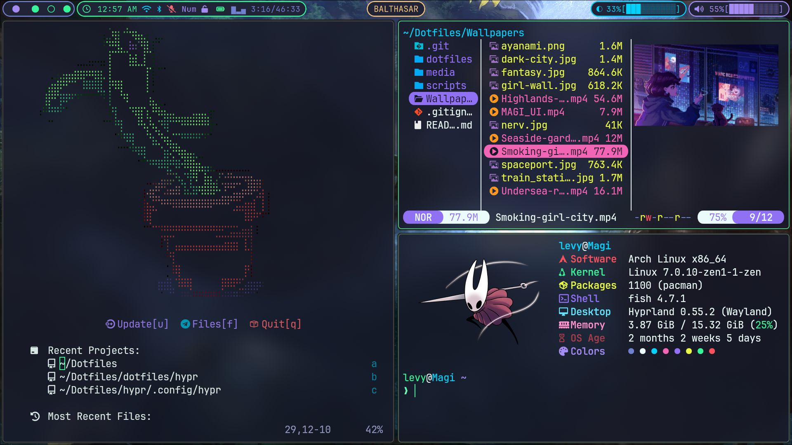

# Levy's Dotfiles

The purpose of this repository is simply to keep track of my dotfiles, feel free to use anything that you find useful here :D. This configuration was made using Arch, other distros have not been tested and may not work.

### Preview 



## Usage

### Hyprland keybinds

| Binds                        | Keybind description                   |
|------------------------------|---------------------------------------|
| Alt + Space                  | Open app launcher                     |
| Ctrl + Space                 | Open terminal                         |
| Super + Q                    | Close window                          |
| Super + B                    | Open firefox (browser)                |
| Super + E                    | Open yazi (terminal file manager)     |
| Super + G                    | Open steam (game launcher)            |
| Super + V                    | Open clipboard manager                |
| Super + N                    | Toggle notification center            |
| Super + P                    | Use colorpicker and copy to clipboard |
| Alt + Tab, Alt + Shift + Tab | Cycle througth opened windows         |
| More                         | TODO                                  |

### Neovim keybinds

Only custom keybinds are shown here as all the usual keybindings from neovim (vimmotions, yanking, pasting, changing, etc) work as usual and have their default values.

| Binds                        | Keybind description                       |
|------------------------------|-------------------------------------------|
| Alt + w                      | Save file                                 |
| Alt + q                      | Close file                                |
| Alt + r                      | Source file                               |
| Alt + t                      | Open new tab                              |
| Alt + up, Alt + down         | Move current line up or down              |
| Alt + e                      | Open file tree                            |
| Alt + m                      | Toggle Markview                           |
| Alt + v                      | Browse recent files using telescope       |
| Alt + f                      | Find files in current dir using telescope |
| Alt + g                      | Fuzzy find in current dir using telescope |
| Ctrl + c                     | Change colorscheme                        |
| Ctrl + g                     | Git status of current dir                 |
| Shift + k                    | Language Server: Hover on cursor          |
| r + n                        | Language Server: Rename buffer            |
| g + d                        | Language Server: Go to definition         |
| g + r                        | Language Server: Go to reference          |
| g + c + a                    | Language Server: Display code actions     |

## Installation Steps

### Manual 

1. Install an AUR helper if you don't have one installed already. 

```bash
sudo pacman -S --needed base-devel
git clone https://aur.archlinux.org/paru.git
cd paru
makepkg -si
```

2. Ensure that all dependencies are installed.

```bash
# Download dependencies
sudo pacman -S btop fish yazi kitty swaync waybar fastfetch \
               neovim npm wget unzip ripgrep tree-sitter-cli \
               hyprland hyprpaper hyprlock hyprshot hyprpicker hyprshutdown \

# Download AUR packages
paru -S mpvpaper wlctl-bin vicinae-bin snappy-switcher 
```

3. Clone the repository and symlink the desired configuration files 

```bash
git clone https://github.com/Alexander-Levy/Dotfiles.git
stow --target="<target_dir>" --dir="<../source_dir>" <package>
```

### Automated 

Clone the repo and run the installation script. It will detect & download all missing dependencies, install an AUR helper if one is not present in the system, and sync the configuration files.

```bash
git clone https://github.com/Alexander-Levy/Dotfiles.git
cd Dotfiles/scripts
./install.sh
```

## TODO
- [ ] Complete list of hyprland binds

