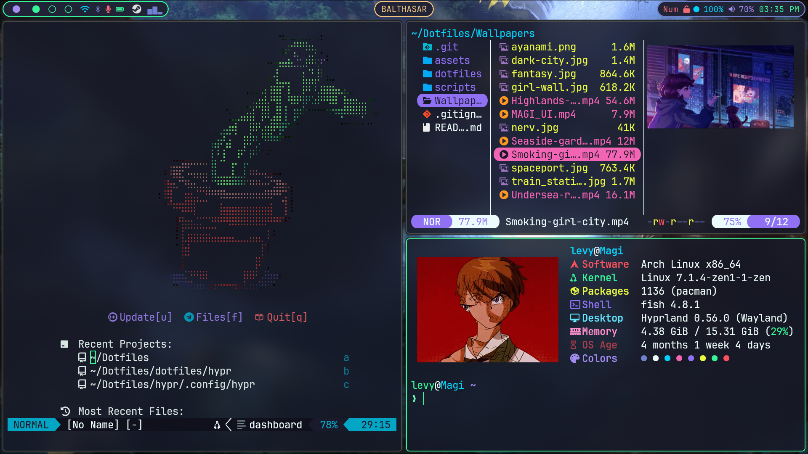

# Levy's Dotfiles

The purpose of this repository is simply to keep track of my dotfiles, feel free to grab anything that you find useful here :D. This configuration was made using Arch, other distros will not work. It includes configuration files for the packages i use, some wallpapers and few scripts to act as a sorts of dotfile installer/manager. 

### Preview 



## Usage

### Hyprland keybinds

| Binds                        | Keybind description                   |
|------------------------------|---------------------------------------|
| Alt + Space                  | Open app launcher                     |
| Ctrl + Space                 | Open terminal                         |
| Super + Q                    | Close window                          |
| Super + B                    | Open firefox (browser)                |
| Super + E                    | Open yazi (terminal file manager)     |
| Super + G                    | Open steam (game launcher)            |
| Super + V                    | Open clipboard manager                |
| Super + N                    | Toggle notification center            |
| Super + P                    | Use colorpicker and copy to clipboard |
| Alt + Tab, Alt + Shift + Tab | Cycle througth opened windows         |
| More                         | TODO                                  |

### Neovim keybinds

Only custom keybinds are shown here as all the usual keybindings from neovim (vimmotions, yanking, pasting, changing, etc) work as usual and have their default values.

| Binds                        | Keybind description                       |
|------------------------------|-------------------------------------------|
| Alt + w                      | Save file                                 |
| Alt + q                      | Close file                                |
| Alt + r                      | Source file                               |
| Alt + t                      | Open new tab                              |
| Alt + up, Alt + down         | Move current line up or down              |
| Alt + e                      | Open file tree                            |
| Alt + m                      | Toggle Markview                           |
| Alt + v                      | Browse recent files using telescope       |
| Alt + f                      | Find files in current dir using telescope |
| Alt + g                      | Fuzzy find in current dir using telescope |
| Ctrl + c                     | Change colorscheme                        |
| Ctrl + g                     | Git status of current dir                 |
| Shift + k                    | Language Server: Hover on cursor          |
| r + n                        | Language Server: Rename buffer            |
| g + d                        | Language Server: Go to definition         |
| g + r                        | Language Server: Go to reference          |
| g + c + a                    | Language Server: Display code actions     |

## Installation Steps

### Manual 

1. Install an AUR helper if you don't have one installed already. 
2. Ensure that all dependencies are installed.
3. Clone the repository and symlink the desired configuration files 

```bash
git clone https://github.com/Alexander-Levy/Dotfiles.git
stow --target="<target_dir>" --dir="<../source_dir>" <package>
```

### Automated 

Clone the repo and run the installation script. It will detect & download all missing dependencies, install an AUR helper if one is not installed already, and sync the configuration files. If you already installed and want something new that was added simply run the update script, no need to resintall :D.

```bash
git clone https://github.com/Alexander-Levy/Dotfiles.git
cd Dotfiles/scripts
./install.sh
```

## TODO
- [ ] Complete list of hyprland binds

